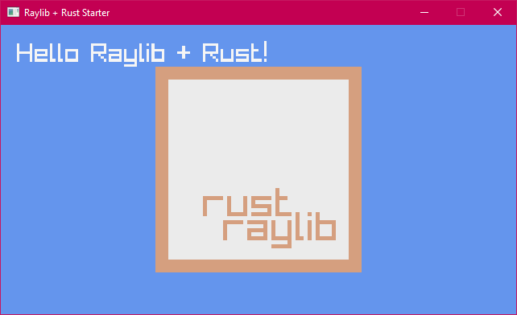

Based on [raylib-rs](https://github.com/deltaphc/raylib-rs).

You can read more examples on that repository.

I made this repository to get started with Rust & Raylib quickly with the common startup parameters.
